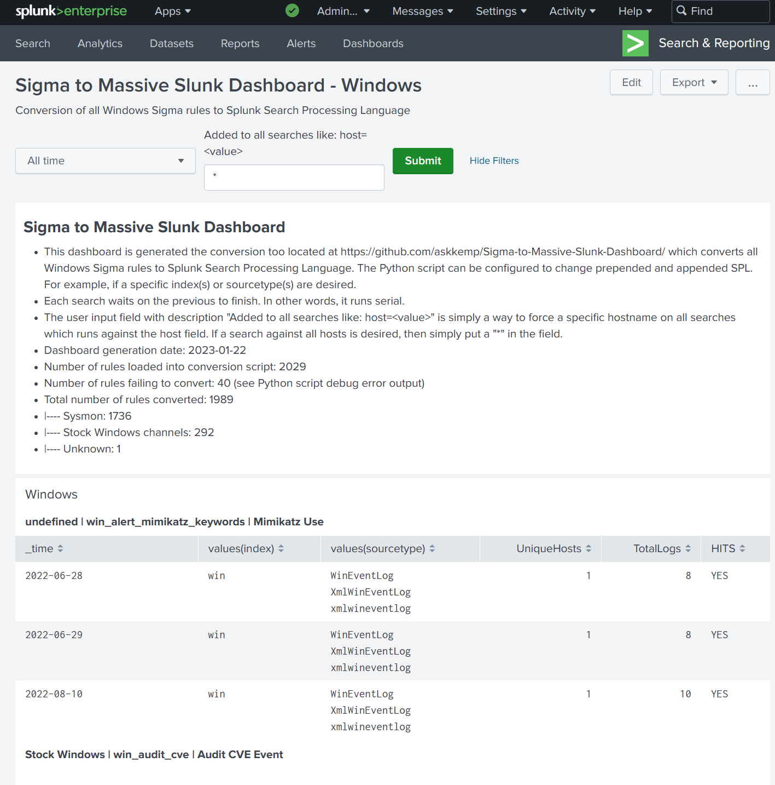

# Introduction
This Python script parses folder(s) of Windows Sigma rules and converts them to Splunk Search Processing Language (SPL) and then buils a massive Splunk classic dashboard. The converion of all Sigma Windows rules generates over 2000 searches in the dashboard. The searches within the dashboard are designed to run one-at-a-time from top to bottom. 

# How to use Script
1. Download all the Sigma rules from https://github.com/SigmaHQ/sigma
2. Edit the `Sigma_to_Splunk_dashboard.py` and change the `CONFIGURE ME` section to point to the location where the Windows Sigma rules are located
3. If you want to specify an index or sourcetype for each search, change `prepend_splunk_search` within the `CONFIGURE ME` section
4. Run the script. For example: `$ python3.9 Sigma_to_Splunk_dashboard.py`. Note that some rules will not convert and error reporting will write to stdout.
6. Once the conversion is complete, the file `dashboard.xml` will be written to where you ran the script from
7. Open `dashboard.xml` and copy the xml contents from it into a the source section of a new Splunk classic dashboard. 
8. Save the Splunk dashboard and wait. Your browser may panic but allow it to continue and after a few minutes, the dashboard will render in the browser, and searches will start.

# How to use Dashboard
1. The initial loading of the dashboard will take a few minutes. Your browser may complain but allow it to continue. Your browser may require 1GB+ of RAM.
2. The dashboard requires a time to be chosen 
3. The optional field called `Added to all searches like: host=<value>` is where you can enter in the hostname of a computer which applies to all 2000+ queries. If no value is entered, it defaults to a `*` which means the search will run against all logs which have the `host` field present.
4. After choosing the values, press the `Submit` button and watch as one query, top-to-bottom, completes after the previous one completes. 
  
# Dashboard.xml Tested with:
* Splunk Enterprise v9.0.3
* Splunk Add-on for Sysmon (Splunk_TA_microsoft_sysmon) v3.0.0
* Splunk Add-on for Microsoft Windows  (Splunk_TA_windows) v8.5.0

# Requirements
The following are needed for this Python script to run successfully:
* Python 3.9
* Sigma rules - https://github.com/SigmaHQ/sigma
* PySigma library - https://github.com/SigmaHQ/pySigma
* PySigma addon - https://github.com/SigmaHQ/pySigma-backend-splunk
* PySigma addon -https://github.com/SigmaHQ/pySigma-pipeline-sysmon
